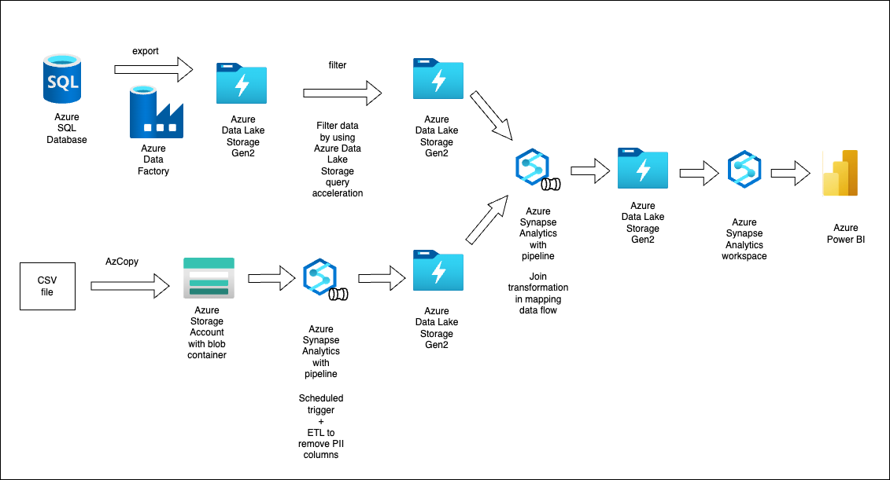

# Assignment

# Exercises

## Fix the Azure DevOps CI/CD Pipeline

**Issues:**

* Feature branches seem to not run automatically when a Git push is done to Azure DevOps.
* Manual run of the pipeline does not show the production environment.
* The person that wrote the resources is not sure of the details they wrote down.
* The name of the application being used - awesome-app - needs to be turned into a variable
* The version of the application needs to be saved into a variable to be able use it in another stage.
* The versioning stage needs to happen only for the development environment parameter.
* The pipeline does not deploy to all environments.
* The pipeline does not specify that only the main branch can deploy to production and that the other branches cannot.

## Solution
See the `devops_exercise/pipeline.yaml`
## Desinging Azure Cloud Data services
Given the very high level architecture in the `high_level_arch.pdf`, please come up with a design that could include Azure Services or any other technologies and give some reasons for each choice.

## Solution

